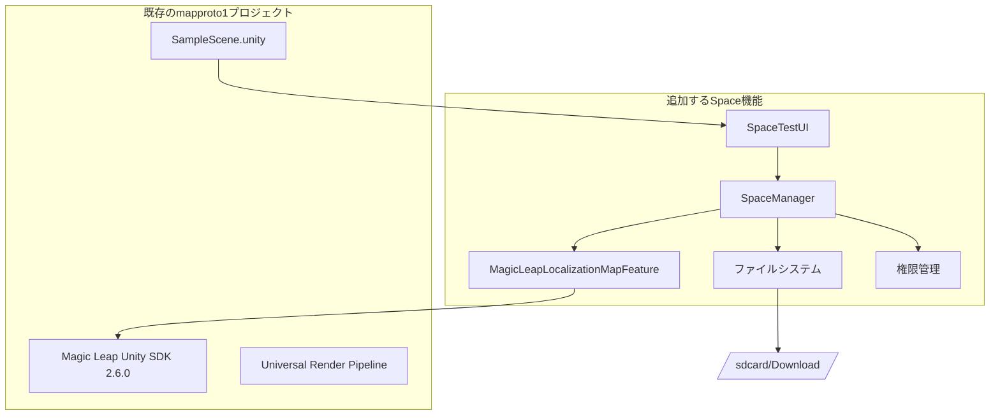

# 設計文書

## 概要

本文書は、Magic Leap 2でSpaceのエクスポート・インポート機能を実証するテストアプリケーションの設計を定義します。アプリケーションは、Magic Leap Unity SDKの`MagicLeapLocalizationMapFeature`を使用して、最新のSpaceを自動的にエクスポートし、そのファイルをインポートして、インポートされたSpaceにローカライズする機能を提供します。

## アーキテクチャ

### 既存プロジェクト（mapproto1）ベースの拡張

現在のmapproto1プロジェクトは、Magic Leap 2で動作確認済みの最小構成テンプレートです。この既存構成に以下のコンポーネントを追加してSpace機能を実装します。

### システム構成



### レイヤー構成

1. **既存レイヤー**: SampleScene、Magic Leap SDK、URP設定
2. **追加UI Layer**: SpaceTestUI（既存シーンに追加）
3. **追加Business Logic Layer**: SpaceManager（新規作成）
4. **既存API Layer**: MagicLeapLocalizationMapFeature（SDK内）
5. **System Layer**: ファイルシステム、権限管理（新規作成）

## コンポーネントと インターフェース

### 1. SpaceTestManager（統合コンポーネント）

**責務:**
- Space操作の統合管理
- エクスポート・インポート・ローカライゼーション処理
- 権限チェックと要求
- UI制御とイベント処理
- エラーハンドリング

**主要メソッド:**
```csharp
public class SpaceTestManager : MonoBehaviour
{
    // UI要素
    [SerializeField] private Button exportButton;
    [SerializeField] private Button importButton;
    [SerializeField] private Button localizeButton;
    [SerializeField] private Text statusText;
    
    // 初期化と権限チェック
    private async void Start()
    
    // 最新Spaceのエクスポート
    public async void OnExportButtonClicked()
    
    // Spaceファイルのインポート
    public async void OnImportButtonClicked()
    
    // インポートされたSpaceへのローカライゼーション
    public async void OnLocalizeButtonClicked()
    
    // 権限チェックと要求
    private async Task<bool> CheckAndRequestPermissionsAsync()
    
    // ステータス更新
    private void UpdateStatus(string message)
    
    // エラーハンドリング
    private void HandleError(string operation, Exception ex)
}
```

## データモデル

### SpaceData構造体

```csharp
[System.Serializable]
public struct SpaceData
{
    public string mapId;
    public LocalizationMapState state;
    public LocalizationMapType type;
    public DateTime timestamp;
}
```

### 操作結果

```csharp
public enum OperationResult
{
    Success,
    PermissionDenied,
    NoSpaceFound,
    FileNotFound,
    APIError,
    UnknownError
}
```

## エラーハンドリング

### エラー分類と対応

1. **権限エラー**
   - 権限が不足している場合
   - 対応: 権限要求ダイアログ表示、再試行

2. **APIエラー**
   - Magic Leap API呼び出し失敗
   - 対応: XrResultコードに基づくエラーメッセージ表示

3. **ファイルシステムエラー**
   - ファイル読み書き失敗
   - 対応: ストレージ状態確認、適切なエラーメッセージ

4. **Spaceエラー**
   - Space が見つからない
   - ローカライゼーション失敗
   - 対応: 状態に応じた適切なメッセージ表示

### エラーメッセージ設計

```csharp
public static class ErrorMessages
{
    public const string PERMISSION_DENIED = "権限が拒否されました。設定から権限を有効にしてください。";
    public const string NO_SPACE_FOUND = "エクスポート可能なSpaceが見つかりません。";
    public const string FILE_NOT_FOUND = "インポート用ファイルが見つかりません。";
    public const string EXPORT_FAILED = "Spaceのエクスポートに失敗しました。";
    public const string IMPORT_FAILED = "Spaceのインポートに失敗しました。";
    public const string LOCALIZATION_FAILED = "ローカライゼーションに失敗しました。";
}
```

## テスト戦略

### 単体テスト

1. **SpaceManager テスト**
   - 権限チェック機能
   - エクスポート・インポート・ローカライゼーション機能
   - エラーハンドリング

2. **PermissionManager テスト**
   - 権限チェック機能
   - 権限要求機能

### 統合テスト

1. **PCでのビルドテスト**
   - コンパイルエラーがないことの確認
   - 依存関係の確認
   - ビルド成功の確認

2. **Magic Leap 2でのエンドツーエンドテスト**
   - Export → Import → Localize の完全フロー
   - 各種エラーケースの検証
   - 権限要求フローの確認
   - 実際のSpaceデータでの動作確認

### テストシナリオ

1. **PC環境でのテスト**
   - ビルドエラーがないことの確認
   - UI要素が正しく配置されていることの確認
   - スクリプトの構文エラーがないことの確認

2. **Magic Leap 2での正常系テスト**
   - 権限が付与された状態でのExport/Import/Localize
   - 各操作の成功確認
   - 実際のSpaceデータでの動作確認

3. **Magic Leap 2での異常系テスト**
   - 権限が拒否された場合
   - Spaceが存在しない場合
   - ファイルが存在しない場合
   - API呼び出しが失敗した場合

## 実装の詳細

### ファイル構成（既存プロジェクトへの追加）

```
Assets/
├── Scripts/                     # 新規作成
│   └── SpaceTestManager.cs      # 全機能統合（UI、権限、Space操作）
├── Scenes/
│   └── ML2basic.unity           # 既存シーンを拡張
└── TutorialInfo/                # 既存（保持）
    └── Scripts/
        └── Readme.cs            # 既存
```

### 既存シーンの拡張

ML2basic.unityに以下を追加:
- Canvas（UI Root）
- SpaceTestManager（GameObject + Script）
- UI要素（Button x3, Text x1）を直接配置
- 必要なOpenXR設定の確認

### 設定要件（既存設定への追加）

1. **OpenXR Features（追加設定）**
   - Magic Leap 2 Localization Maps: 有効化
   - Magic Leap 2 Spatial Anchors Subsystem: 有効化
   - Magic Leap 2 Spatial Anchors Storage: 有効化

2. **Manifest権限（追加）**
   - `com.magicleap.permission.SPACE_MANAGER`
   - `com.magicleap.permission.SPACE_IMPORT_EXPORT`
   - `com.magicleap.permission.SPATIAL_ANCHOR`

3. **既存ビルド設定（確認）**
   - Target Platform: Android（既存）
   - XR Plugin Management: OpenXR（既存）
   - Magic Leap 2 Provider: 有効（既存）
   - Magic Leap Unity SDK 2.6.0（既存）

### パフォーマンス考慮事項

1. **非同期処理**
   - すべてのSpace操作を非同期で実行
   - UIの応答性を維持

2. **メモリ管理**
   - Spaceデータの適切な解放
   - 大きなバイナリファイルの効率的な処理

3. **エラー回復**
   - 操作失敗時の適切なクリーンアップ
   - リトライ機能の実装
#
# 既存プロジェクトとの統合

### 既存アセットの活用

1. **ML2basic.unity**
   - 既存のシーン設定を保持
   - SpaceTest用UIを追加
   - カメラ、ライティング設定はそのまま使用

2. **Magic Leap設定**
   - 既存のMagicLeapSettings.asset活用
   - XR設定は既に構成済み
   - 追加でLocalization Maps機能のみ有効化

3. **URP設定**
   - 既存のUniversal Render Pipeline設定を保持
   - Mobile_RPAsset.assetなど既存設定を活用

### 最小限の変更方針

1. **ファイル変更の最小化**
   - 既存ファイルの変更は最小限に抑制
   - 新規ファイル作成も最小限に抑制
   - 可能な限り既存構造を活用

2. **シーン拡張**
   - ML2basic.unityにUI要素を直接追加
   - 既存のGameObjectは保持
   - Prefabは作成せず、シーン内に直接配置

3. **スクリプト統合**
   - 単一のSpaceTestManager.csファイルで全機能を実装
   - 権限管理、UI制御、Space操作を一つのクラスに統合
   - 複数ファイルに分割せず、シンプルな構成を維持

4. **設定追加**
   - OpenXR Featuresに必要な機能を追加
   - Manifest権限を追加
   - 既存設定は変更しない

### 開発・テスト環境

既存のmapproto1プロジェクトは以下が確認済み:
- Magic Leap 2での動作確認済み
- ビルド・デプロイ環境構築済み
- 基本的なXR機能動作確認済み

この安定した基盤の上にSpace機能を追加することで、開発リスクを最小化し、確実な動作を保証します。